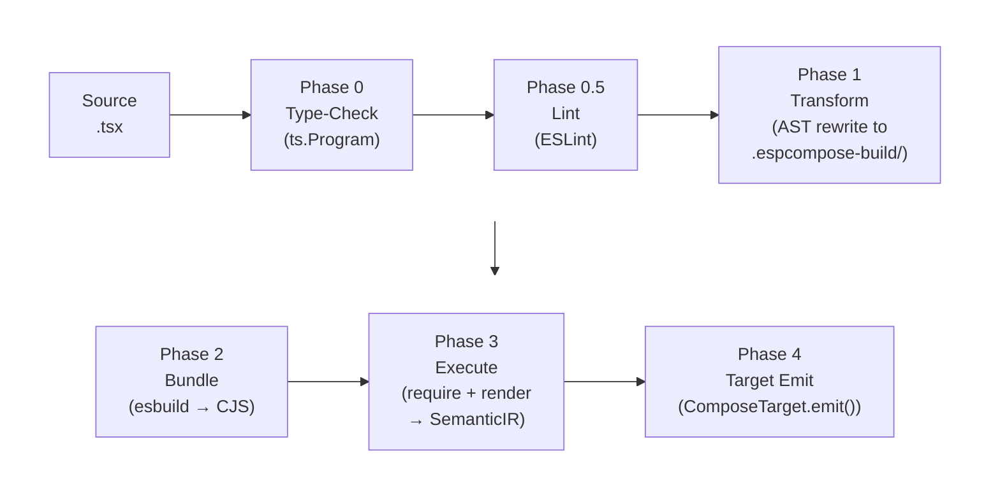
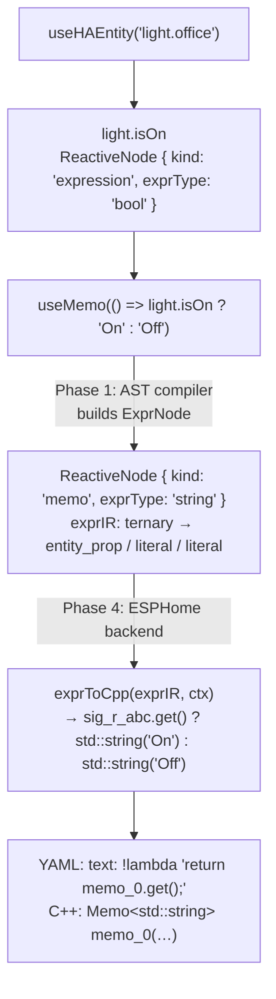
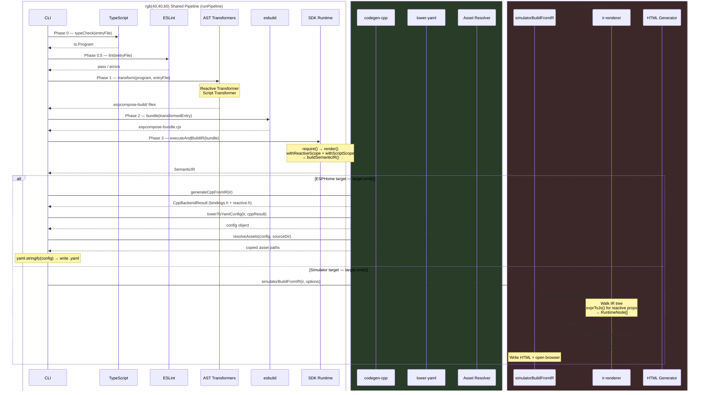

# ESPCompose Architecture Overview

ESPCompose is a TypeScript-to-ESPHome compiler. You write UI and automation logic in JSX/TSX, and the compiler produces ESPHome YAML configuration plus C++ header files that run on ESP32 microcontrollers. There is also a browser-based simulator for previewing LVGL UIs without hardware.

## Packages

```
packages/
  core/             Core runtime — JSX execution, reactive hooks, IR types
  cli/              Compiler — AST transforms, bundling, build orchestration
  target-esphome/   ESPHome backend — YAML + C++ header generation
  target-simulator/ Browser preview — HTML/JS output from the same IR
  ui/               Pre-built UI components and theme system
  eslint/           Custom lint rules for JSX correctness
  demo/             Example projects
  e2e/              Integration tests with snapshot verification
```

## Compiler Pipeline

The compiler runs six phases to turn a `.tsx` source file into ESPHome configuration:



A secondary entry point, `compileToIR()`, runs Phases 0–3 and returns the `SemanticIR` directly — useful as a programmatic API for tools that need the IR without emitting target-specific files.

### Phase 0: Type-Check

The TypeScript compiler creates a `ts.Program` and performs full type-checking on the source files. Type errors are reported immediately, failing the build before any transforms run.

### Phase 0.5: Lint

ESLint validation runs on the original source files using the project's custom ESPCompose rules (from `packages/eslint/`). This catches JSX correctness issues before transformation.

### Phase 1: AST Transform

The TypeScript AST is visited file-by-file. Two transformers run on each file:

**Reactive Transformer** — Finds JSX attributes and `useMemo()` calls that reference reactive values (signals from Home Assistant entities or theme variables). For each one it:

1. Extracts the expression AST into an **ExprNode** (a target-agnostic IR tree)
2. Identifies upstream dependencies (which HA entities or theme paths are read)
3. Infers the expression's return type as an **ExprType** (`'int'` | `'float'` | `'string'` | `'bool'` | `'color'` | `'font_ptr'`)
4. Replaces the original code with a `__espcompose.compiled({ type, deps, expr })` call carrying this pre-computed metadata

**Script Transformer** — Finds arrow functions on trigger props (e.g. `onPress`, `on_state`) and compiles them into **action trees** — a structured representation of imperative ESPHome actions like `delay`, `if-then-else`, `repeat`, service calls, and ref method invocations.

Transformed files are written to `.espcompose-build/`, preserving the directory structure. With `--debug`, these files are human-readable.

### Phase 2: Bundle

**esbuild** bundles the transformed TypeScript into a single CommonJS file. The SDK (`@espcompose/core`) is kept external — it will be provided at execution time. Library format versions are validated here: if a dependency was compiled with an incompatible `LIBRARY_FORMAT_VERSION`, the build fails with a clear error.

### Phase 3: Execute & Render

The bundled CJS file is `require()`'d in Node.js. Two scoping contexts wrap the execution:

- **Reactive scope** — collects all `ReactiveNode` instances, HA entity registrations, component refs (images/fonts), and reactive bindings created during the render pass
- **Script scope** — collects `useScript()` definitions

The SDK's `render()` function walks the JSX tree recursively:
- Function components are called, their output recursively rendered
- Intrinsic elements (`<sensor>`, `<wifi>`, `<lvgl>`, etc.) become config sections
- LVGL widgets are processed through a dedicated LVGL builder

The output is a **Semantic IR** — a tree of typed IR nodes that preserve all metadata (reactive bindings, refs, actions, secrets) without any target-specific encoding.

### Phase 4: Target Emit

The compiler delegates to a `ComposeTarget` implementation via `target.emit({ ir, projectDir, outDir, sourceDir })`. The compiler has no knowledge of what the target does — it simply hands off the `SemanticIR` and a set of paths.

**ESPHome target** (`createEsphomeTarget()`):

1. **espcompose_bindings.h** + **espcompose_reactive.h** — C++ headers for the reactive runtime
2. **esphome.yaml** — Full ESPHome configuration serialized via `yaml.stringify()`
3. Asset files copied to `.espcompose/assets/`

**Simulator target** (`createSimulatorTarget()`):

1. Walks the IR to build a `RuntimeNode` tree of LVGL widgets
2. Lowers `ExprNode` trees to JavaScript via `exprToJs()`
3. Writes an HTML page with canvas rendering and mock HA entity state
4. Opens the HTML in the default browser

## Semantic IR

The IR sits between the render pass and the backend. Every value in the rendered tree is wrapped in a typed node:

| IR Node | Represents |
|---------|-----------|
| `IRScalar` | Plain string, number, or boolean |
| `IRObject` | Key-value map of IR values |
| `IRArray` | Ordered list of IR values |
| `IRNull` | Null value |
| `IRReactive` | Reactive binding — wraps a `ReactiveNode` with full metadata |
| `IRRef` | Cross-component reference (e.g. `useRef<typeof Light>()`) |
| `IRAction` | Compiled action tree (12 action kinds) |
| `IRSecret` | Secret reference (`!secret` in YAML) |
| `IRTriggerVar` | Trigger variable for lambda injection |

The IR is defined in `packages/core/src/ir/types.ts`. Building it is handled by `packages/core/src/ir/build.ts`.

## Reactive System

The reactive system tracks dependencies between Home Assistant entities and UI properties, generating a C++ signal graph that updates widgets automatically when entity state changes.

### Hooks

| Hook | Purpose | ReactiveNode kind |
|------|---------|-------------------|
| `useHAEntity(id)` | Binds to a Home Assistant entity; returns typed signals for its properties | `'expression'` |
| `useMemo(fn)` | Derives a value from one or more signals | `'memo'` |
| `useEffect(fn)` | Runs side effects when dependencies change | `'effect'` |

Each hook creates a `ReactiveNode` that carries:

- **`exprIR`** — An `ExprNode` tree representing the expression structure (set by the AST compiler in Phase 1)
- **`exprType`** — The return type as a domain-level type (`'int'`, `'float'`, `'string'`, `'bool'`, `'color'`, `'font_ptr'`)
- **`dependencies`** — Which source entities and triggers this node reads from

### Expression IR (ExprNode)

ExprNode is a target-agnostic AST for reactive expressions. The 17 node kinds are:

| Kind | Example |
|------|---------|
| `literal` | `42`, `"hello"`, `true` |
| `signal_read` | Reading a signal by index |
| `memo_read` | Reading a memo by index |
| `binary` | `a + b`, `x > 5` |
| `unary` | `!flag`, `-value` |
| `postfix` | `count++` |
| `ternary` | `isOn ? "On" : "Off"` |
| `call` | `is_nan(x)`, `round(v)` |
| `concat` | String concatenation with `+` |
| `to_string` | Numeric-to-string conversion |
| `group` | Parenthesized sub-expression |
| `slot` | Placeholder in slotted (library) expressions |
| `resolve_font` | Font family + size → font pointer resolution |
| `theme_read` | Reading a theme variable by path |
| `entity_prop` | Reading an entity property (e.g. `light.office.isOn`) |
| `component_read` | Reading a component's state via `id(comp).state` |
| `trigger_var` | Trigger callback variable (e.g. `x` in `on_value`) |

Each backend lowers ExprNode to target code:
- **ESPHome**: `exprToCpp(node, ctx)` in `packages/target-esphome/src/expr-to-cpp.ts` → C++ lambda bodies
- **Simulator**: `exprToJs(node)` in `packages/target-simulator/src/backends/expr-to-js.ts` → JavaScript

### CppLoweringContext

When the ESPHome backend processes reactive nodes, it builds a `CppLoweringContext` that maps abstract IR references to concrete C++ identifiers:

```typescript
interface CppLoweringContext {
  signalNames: Map<number, string>;        // signal index → "sig_ha_light_office"
  memoNames: Map<number, string>;          // memo index → "memo_0"
  slotExprs: Map<number, string>;          // slot index → C++ expression
  entityComponentIds: Map<string, string>; // "light.office" → "ha_light_office"
  themeVarNames: Map<string, string>;      // "colors_primary_bg" → "thm_colors_primary_bg"
}
```

This context is threaded through `exprToCpp()` so the same ExprNode tree can be lowered with different signal naming strategies (e.g. initial-value lambdas vs. runtime lambdas read from different sources).

### End-to-End Flow



## Theme System

Themes are plain TypeScript objects with nested color, spacing, and typography values:

```tsx
const theme = { colors: { primary: { bg: '#1E88E5' } }, spacing: { md: 8 } };
```

At render time, the theme is flattened into a `Record<path, ThemeLeaf>` (e.g. `colors_primary_bg → { value: '#1E88E5', cppType: 'lv_color_t' }`). Each leaf's **`cppType`** is inferred from the JS value — this is a legitimate C++ type annotation describing the storage type in the generated C++ theme arrays, not part of the Expression IR system.

When a component reads a theme value, a `theme_read` ExprNode is created. The ESPHome backend generates a C++ memo per theme path that indexes into a theme value array, enabling runtime theme switching without re-rendering.

## Trigger Registry

The trigger registry (`packages/core/src/trigger-registry.ts`) is a hand-maintained map from ESPHome component domains and trigger names to the variables available inside trigger callbacks. For example, `binary_sensor.on_state` provides variable `x` with **`cppType: 'bool'`**.

These `cppType` values are C++ type annotations that describe ESPHome's actual lambda parameter types — they come from ESPHome's C++ source code and are used by the backend when generating trigger lambda signatures. This is separate from the Expression IR system; these types describe the ESPHome runtime API, not user expressions.

## Action System

Arrow functions on trigger props are compiled into structured action trees:

```tsx
<button onPress={() => {
  myLight.turnOn({ brightness: 0.5 });
  await delay(1000);
  if (someCondition) { myLight.turnOff(); }
}} />
```

The action compiler recognizes 12 action kinds: `native`, `ha_service`, `logger`, `delay`, `wait_until`, `if`, `while`, `repeat`, `script_execute`, `script_wait`, `script_stop`, and `internal_lambda`. Each becomes an `IRAction` node in the Semantic IR, which the YAML backend serializes to ESPHome action blocks.

## Library Compilation

Component libraries can be pre-compiled with `espcompose library` so consumers don't need the TypeScript source:

1. AST transform runs on library sources (same reactive + script transforms)
2. esbuild bundles to CJS + ESM
3. TypeScript emits `.d.ts` declarations
4. A `__espcompose_format__` version marker is injected

At consumer build time, the compiler validates that imported libraries match the current `LIBRARY_FORMAT_VERSION` (currently **2**). Mismatched versions produce a clear error with rebuild instructions.

The compiled format stores reactive metadata inline:
```js
__espcompose.compiled({ type: "string", deps: [...], expr: { kind: "ternary", ... } })
```

## Asset Pipeline

Images and fonts referenced in JSX are tracked during the render pass via `ComponentRegistration` entries. At emit time:

- **Images**: Source files are resolved relative to the project root and copied to `.espcompose/assets/`. YAML references use relative paths.
- **Fonts**: Font metadata is captured and injected into the LVGL configuration section. TTF files are copied alongside images.

## Simulator

The simulator is an alternative backend that produces a browser-based LVGL preview from the same Semantic IR. It:

1. Walks the IR tree to build a `RuntimeNode` tree of LVGL widgets
2. Lowers ExprNode trees to JavaScript via `exprToJs()`
3. Generates an HTML page with canvas rendering and mock HA entity state
4. Opens the HTML in the default browser for one-shot preview

## Target Interface

The compiler communicates with backends through the `ComposeTarget` interface defined in `packages/core/src/target.ts`. The compiler has no knowledge of what any target does — it simply passes the `SemanticIR` and path information.

```typescript
interface ComposeTarget {
  name: string;
  emit(request: EmitRequest): Promise<EmitResult>;
}

interface EmitRequest {
  ir: SemanticIR;
  projectDir: string;   // project root (where package.json lives)
  outDir: string;        // where to write output files
  sourceDir: string;     // directory of the TSX entry file
}

interface EmitResult {
  files: string[];       // paths of all files written
}
```

Targets are created via factory functions following a consistent pattern:

- `createEsphomeTarget()` — ESPHome YAML + C++ headers
- `createSimulatorTarget(options?)` — Browser-based LVGL preview HTML

## Target Pipeline Comparison

Both targets share Phases 0–3 (type-check → lint → transform → bundle → execute) via a shared `runPipeline()` helper inside the compiler. They diverge at Phase 4 where the `ComposeTarget.emit()` method is called:



## Key File Reference

| Concept | File |
|---------|------|
| CLI commands | `packages/cli/src/cli.ts` |
| Compiler pipeline | `packages/cli/src/compiler/compiler.ts` |
| Target interface | `packages/core/src/target.ts` |
| ESPHome target | `packages/target-esphome/src/target.ts` |
| Simulator target | `packages/target-simulator/src/target.ts` |
| Reactive transformer | `packages/cli/src/compiler/transform/reactive-transformer.ts` |
| Script transformer | `packages/cli/src/compiler/transform/script-transformer.ts` |
| Expression compiler | `packages/cli/src/compiler/transform/expr-compiler.ts` |
| Action compiler | `packages/cli/src/compiler/transform/action-compiler.ts` |
| Library pre-compilation | `packages/cli/src/transform-lib.ts` |
| SDK render / runtime | `packages/core/src/runtime.ts` |
| ReactiveNode class | `packages/core/src/reactive-node.ts` |
| ExprNode types | `packages/core/src/ir/expr-types.ts` |
| Semantic IR types | `packages/core/src/ir/types.ts` |
| IR builder | `packages/core/src/ir/build.ts` |
| Hooks (useHAEntity, useMemo, useEffect) | `packages/core/src/hooks/` |
| Theme signals | `packages/core/src/theme-signals.ts` |
| Trigger registry | `packages/core/src/trigger-registry.ts` |
| YAML lowering | `packages/target-esphome/src/lower-yaml.ts` |
| C++ codegen | `packages/target-esphome/src/codegen-cpp.ts` |
| ExprNode → C++ | `packages/target-esphome/src/expr-to-cpp.ts` |
| Bindings header gen | `packages/target-esphome/src/bindings-codegen.ts` |
| Reactive config builder | `packages/target-esphome/src/reactive-config.ts` |
| HA sensor injection | `packages/target-esphome/src/reactive-injector.ts` |
| Asset resolution | `packages/target-esphome/src/assets.ts` |
| Simulator IR renderer | `packages/target-simulator/src/backends/ir-renderer.ts` |
| ExprNode → JS | `packages/target-simulator/src/backends/expr-to-js.ts` |
| UI components / themes | `packages/ui/src/` |
| ESLint rules | `packages/eslint/src/rules/` |
| Action tree IR types | `packages/cli/src/compiler/ir/action-tree.ts` |
| IR lowering (CLI-side) | `packages/cli/src/compiler/ir/lower-ir.ts` |
